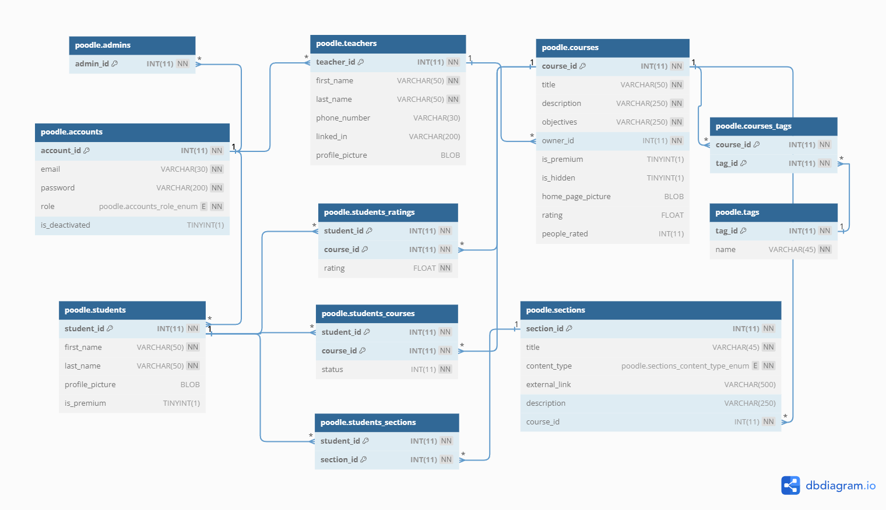

# Poodle: e-learning platform

Python back-end web application, powered by FastAPI. Designed to implement an e-learning platform where teachers can easily create courses, and students can enroll in courses based on their subscription tier.

## Technologies Used

**API:** FastAPI

**Authentication:** OAuth2 with JWT

**Web Server:** Uvicorn

**Production Database:** MariaDB (with **SQLAlchemy ORM**)

**Testing:** Pytest

**Testing Database:** SQLite (with **SQLAlchemy ORM**)

**Database migrations:** implemented using Alembic

**Continuous Integration (CI):** implemented with GitHub Actions

**Email Notification:** implemented with [Mailjet API](https://dev.mailjet.com/)

## Installion and setup

### 1. Clone the project using HTTPS

```
git clone https://github.com/delesray/poodle.git
```

### or SSH

```
git clone git@github.com:delesray/poodle.git
```

### 2. Install the packages listed in the **requirements.txt** file, located at project root level (`poodle`)

(Optional) **Inctructions on creating and activating a virtual environment:** [Link](https://packaging.python.org/en/latest/guides/installing-using-pip-and-virtual-environments/)

```
pip install -r requirements.txt
```

### 3. Navigate to `src/app` directory and run the following command to start the application

```
uvicorn main:app --reload
```

### 4. Swagger docs: [Link](http://127.0.0.1:8000/docs)

Available when you run the server (step 3).

## Testing

### To run the tests, navigate to `src/app` and execute the following command

```
python -m pytest tests
```

## Features

- **Public endpoints** - accessible without authentication
    * Register student
    * Register teacher
    * Login - available through the *Authorize* button on Swagger
    * Get all courses - displays basic information about available courses

- **Authentication Endpoints** (marked with a lock on Swagger) - require login with username and password
  
    - **Features, related to students:**
        * View account
        * Update Account
        * Update profile picture
        * Change password
        * View enrolled courses
        * View pending courses (awaiting approval for subscription)
        * View single enrolled course
        * View enrolled course section
        * Subscribe to course
        * Unsubscribe from course
        * Rate course

    - **Features, related to teachers:**
        * View account
        * Update account
        * Update profile picture
        * View owned courses
        * Create course
        * Update course home picture
        * View pending enrollment requests
        * View course
        * Update course information
        * Approve enrollment request
        * Update course section
        * Remove course section
        * Add sections to course
        * Add tags to course
        * Remove tag from course
        * Deactivate course
        * Generate course reports


    - **Features, related to admins:**
        * View courses
        * Activate/deactivate user account
        * View rating for course
        * Hide course
        * Make student account premium
        * Remove student from course


## Project Structure

```
.github/                     - CI
src/                         - project source
├─ app/                      - primary app folder
│  ├─ api/                   - router logic
│  ├─ core/                  - authentication logic and project settings
│  ├─ crud/                  - crud logic
│  ├─ db/                    - ORM models and database setup
│  ├─ migrations/            - database migrations
│  ├─ schemas/               - Pydantic models
│  ├─ tests/                 - project tests
README.md                    - project description
requirements.txt             - project requirements
```

## Database


